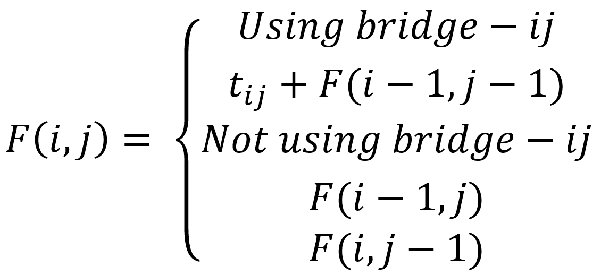

# Solution to Homework2 CS411 UAF
This solution finds the optimal solution to the problem via bottom-up dynamic programming

This project was developed in Clion.
The solution consists of two files build.cpp and build.hpp.
The test file is build_test.cpp.

# The Problem
Continuing from Homework2, the goal is to find the combination of 
bridges to build between cities where:
* No bridges cross
* No city can be reached by two bridges
* The toll can be charged the maximum amount

The definition for bridges crossing are if a < c && b > d or c < a && d > b, with a, b, c, and d being the cities.

As stated in this homework's Assignment_Instructions, the goal is to do this more efficiently by incorporating the 
bottom-up method of dynamic programing.

# Key Highlights
The biggest issue I had to tackle was figuring out the recurrence relation. To do this I had to ask the questions: "What 
would happen if we used bridge-ij? What would happen if we didn't use bridge-ij?"<br/>
This is the recurrence relation that I formulated:


The next biggest issue was figuring out how to represent the bottom-up approach in code.
The first solution I came up with was this: <br/>
```
Initialize results as a 2D vector with width w+1 and height e+1
for windex <- 0 to w
    for eindex <- 0 to e
        bridgeIndices <- findBridges(windex, eindex, bridges)
        for bridgeij <- bridgeIndices.begin() to bridgeIndices.end()
            if windex = 0 & eindex=0 then
                results[windex][eindex] = bridgeij[2]
            else if windex = 0 then
                results[windex][eindex] = max((*bridgeij)[2]), 0, results[windex][eindex-1])
            else if eindex = 0 then
                results[windex][eindex] = max((*bridgeij)[2]), results[windex-1][eindex], 0)
            else 
                if results[windex] > (*bridgeij)[2] then continue;
                result[windex][eindex] = max((*bridgeij)[2]+results[windex-1][eindex-1],
                                                results[windex-1][eindex],
                                                results[windex][eindex-1])
                                                
            if bridgeijIndices.empty() then
                if windex = 0 & eindex=0 then
                    results[windex][eindex] = 0
                else if windex = 0 then
                    results[windex][eindex] = max(0, results[windex][eindex-1])
                else if eindex = 0 then
                    results[windex][eindex] = max(results[windex-1][eindex], 0)
                else 
                    result[windex][eindex] = max(results[windex-1][eindex],
                                                    results[windex][eindex-1])

return results[w-1][e-1]
```
findBridge search the list of bridges for a bridge that contains the same w and e value as windex and eindex, 
respectively. This however, proved way too slow, too slow to finish the tests. 

The next thing that I needed to understand, after which I could reduce the time for the algorithm, was that in the 
above solution I am looping through the bridges each time I increment windex and eindex, The reason I was doing this was 
because I didn't realize that when a vector is created by just indicating the size of it that it initializes the vector 
with all elements as 0. 
The final thing I needed to understand was that the bridges can be traversed once in the beginning. 
With these two ideas I was able to greatly increase the speed of the code and cut down on the number of 
functions used as well as the number of lines.

The way I did this was by creating a new 2D vector which stores the values of the tolls for each bridge at the spot in 
the vector corresponding to the bridge's west and east value. I then eliminated the checks for windex and eindex being 
zero, as well as the check for if a bridge was found.  

```
Initialize results as a 2D vector with width w+1 and height e+1
Initialize tollsOfBridges as a 2D vector with width w and height e
for bridge <- bridges.begin() to bridge.end()
    if(tollsOfBridges[bridge[0]][bridge[1]] < bridge[2] then
        tollsOfBridges[bridge0]][bridge[1]] = bridge[2]

for windex <- 1 to w //Including w
    for eindex <- 1 to e //Including e
        if tollsOfBridges[windex-1][eindex-1] > 0 then
            results[windex][eindex] = max(results[windex-1][eindex-1]+tollsOfBridges[windex-1][eindex-1],
                                        results[windex-1][eindex],
                                        results[windex][eindex-1])
        else
            results[windex][eindex] = max(results[windex-1][eindex], results[windex][eindex-1])

return results[w-1][e-1]
```
This code greatly increased the time that the algorithm took to find the answer, enough to finish the test. 
The reason that the windex and eindex start at 1 is because the algorithm imagines that results has a row and column 
filled with zeros. This is so that I don't have to check if windex and eindex are 0, which was originally written to 
avoid out of bound errors.  

#Time Efficiency
The time efficiency for the solution provided in Assignment 2 was O(2^n) where n was the number of subsets of possible 
bridges. 
The time efficiency for the first solution in this assignment was O(b*n^2) where n is the number of w cites (and e 
cities since e and w are equal), and b is the size of the given bridges.
The time efficiency for the second solution in this assignment was O(n^2 + b). 
            
 
# License
[MIT](https://choosealicense.com/licenses/mit/)
